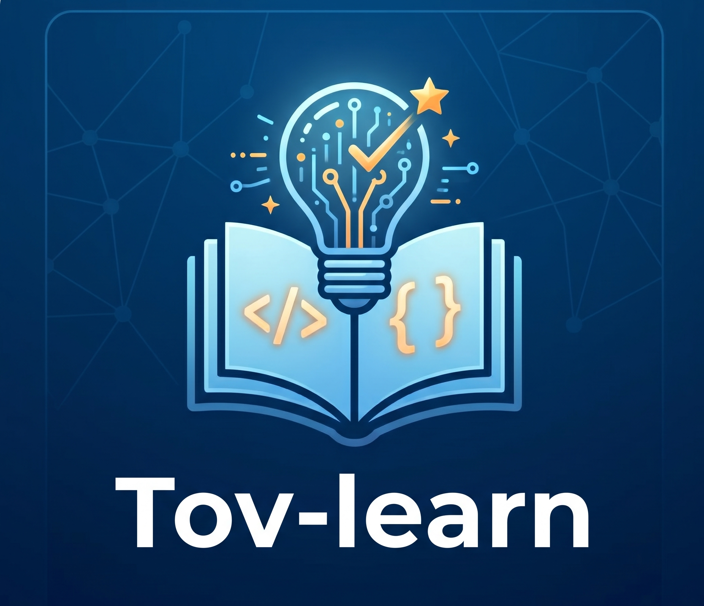

<p align="center">
  <a href="https://tovtech.org">
    
  </a>
</p>

# Tov-learn

[](LICENSE)
[](https://claude.ai/code)
[](https://en.wikipedia.org/wiki/Spaced_repetition)

Interactive AI tutor, built as a Claude Code skill.

> Built and maintained by [TovTech](https://tovtech.org)

---

## Getting Started

### Step 1 — Prerequisites

- [Claude Code](https://claude.ai/code) installed (Pro plan or higher)
- Git

### Step 2 — Clone and open

```bash
git clone https://github.com/TovTechOrg/Tov-learn.git
```

Open the cloned folder in Claude Code.

### Step 3 — Run setup

```
/learn setup
```

This will:
- Ask for your preferred session language (Hebrew / English)
- Ask for your course content folder path
- Optionally configure a TTS voice
- **Install `/learn` globally** — from this point on, `/learn` works in any project on your machine

That's it. Type `/learn 0.1` to start the first lesson.

---

## Usage

```
/learn setup        — configure language, TTS, and course path (run once)
/learn              — smart resume: shows what to do next based on your progress
/learn 0.1          — start lesson 0.1 directly
/learn status       — generate a visual progress dashboard (HTML)
```

### Choosing a lesson

Lessons are numbered by module and index — `0.1`, `0.2`, `1.1`, etc. Browse available lessons in `courses/ai-engineer/COURSE.md`, which lists all modules and their topics.

To start a lesson:
```
/learn 0.1
```

The tutor loads the script, greets you, asks what you already know, and walks through each section interactively. At any point you can type `quiz me` to test yourself, or `stop` to end the session and get a next-step recommendation.

### Analyzing your own project

If you want the tutor to help you understand how a concept applies to a project you're building, open Claude Code inside that project and run:

```
/learn
```

Choose **project analysis** from the menu. The tutor will:
1. Silently scan your codebase (package.json, folder structure, config files)
2. Ask you 5 short questions about the project's purpose, users, and pain points
3. Generate a visual architecture map saved as an HTML file you can open in a browser

This is useful before starting a lesson — the tutor uses your project as a concrete example throughout the session.

### Smart Resume — `/learn`

Typing `/learn` with no arguments doesn't just ask "what do you want to do?" — it reads your actual progress and tells you:

- Which lessons are **overdue** for review (spaced repetition)
- Which lessons are **in progress**
- What the **next new lesson** is

Example output after a few sessions:
```
Welcome back. Here's where things stand:

🔁 Due for review: Lesson 0.2 — What is ML (3 days overdue)
📖 Continue: Lesson 1.1 — Prompt Engineering Basics (in progress)
📖 Next new: Lesson 1.2 — Few-shot and Chain of Thought
🔍 Project analysis

What would you like to do?
```

### Progress Dashboard — `/learn status`

Generates an HTML file at `~/skill-tutor-tutorials/dashboard.html` showing all lessons color-coded by status (mastered / in progress / not started), quiz scores, and what's due for review. Open it in a browser.

### Commands during a session

| Command | Action |
|---------|--------|
| `continue` | Move to the next section |
| `quiz me` | 4-question quiz on everything covered so far |
| `explain again` | Re-explain current section from a different angle |
| `summary` | Bullet-point recap of what was covered |
| `exercises` | Show this lesson's exercises |
| `stop` | End session — shows what's covered, what's left, next recommendation |
| `read aloud` | Speak the last response (on-demand TTS) |
| `settings` | Show current language, TTS, and course path |

---

## What the Tutor Does

Every section is taught using the **Journey Format**:
1. **The problem** — why this matters
2. **The insight** — what experts understand that beginners don't
3. **In your project** — connects the concept to your actual work
4. **Question** — one thinking question before moving on

After quizzes, the tutor tracks your score and tells you when to review the lesson again (spaced repetition: 2 / 13 / 34 / 89 days based on score).

---

## Course Content Structure

Lessons live in `courses/[course-name]/lessons/`:

```
courses/
  ai-engineer/
    COURSE.md
    lessons/
      00-ai-fundamentals/
        0.1-intro-to-ai/
          0.1_script.txt       ← lesson script (split by [מעבר שקף])
          0.1_exercises.md     ← exercises
      01-prompt-engineering/
        ...
```

The tutor auto-detects lesson files by number — `/learn 0.1` finds `0.1_script.txt` automatically.

---

## Files Created at Runtime

All learner data is saved to `~/skill-tutor-tutorials/` (outside the repo):

```
~/skill-tutor-tutorials/
├── settings.json           — language, TTS config, course path
├── learner_profile.md      — background, current project, learning style
├── tutorials/              — per-lesson notes, key insights, Q&A
├── progress/               — quiz scores and next review dates
├── topics/knowledge_map.md — full map of mastered vs. in-progress topics
└── architectures/          — HTML architecture diagrams (from project analysis)
```

---

## Project Structure

```
.claude/commands/
  learn.md                  ← entry point + routing
  learn/
    setup.md                ← first-run configuration
    teaching.md             ← lesson loop + Journey format
    quiz.md                 ← quiz format + spaced repetition
    progress.md             ← saving tutorials and knowledge map
    project-analysis.md     ← codebase scan + architecture map
    display.md              ← visual formatting conventions
courses/
  ai-engineer/              ← course content
CLAUDE.md                   ← architecture overview for contributors
```

---

## Adding a New Module

1. Create `.claude/commands/learn/[module-name].md`
2. Add a row to the modules table in `CLAUDE.md`
3. Add a routing entry in `learn.md` (Step 2 — Route table)
4. Update the global install command in `setup.md`

---

## Requirements

- Claude Code (Pro plan or higher)
- Windows (for TTS voice support) — TTS can be disabled on any OS

## License

MIT
