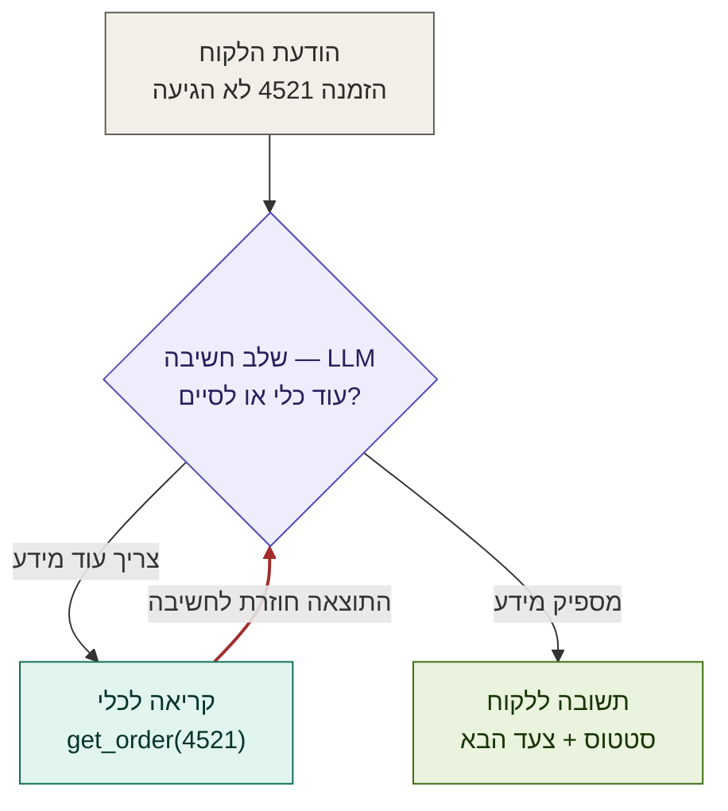

<div dir="rtl" lang="he">

# תרגילים - שיעור 0.1: מודל מנטלי לעבודה עם LLMs

## מידע כללי
- **שיעור:** 0.1 - מודל מנטלי לעבודה עם LLMs
- **קורס:** AI Dev
- **סוג השיעור:** עיוני-מעשי (2 שעות)

---

## תרגיל 1: ספירת Tokens (עבודה אישית - 10 דקות)

### הנחיות:
גשו לאתר **platform.openai.com/tokenizer** (כלי חינמי, לא צריך חשבון).

**א.** כתבו את המשפטים הבאים וספרו Tokens:

| טקסט                                                               | כמות Tokens שציפיתם | כמות Tokens בפועל |
|--------------------------------------------------------------------|---------------------|-------------------|
| "Hello, how are you today?"                                        | 13                  | 8                 |
| "שלום, מה שלומך היום?"                                             | 15                  | 9                 |
| `def calculate_roi(revenue, cost): return (revenue - cost) / cost` | 8                   | 19                |
| "קמתי בבוקר ואכלתי ארוחת בוקר. צחצחתי שיניים, שטפתי פנים והוצאתי את הכלב לטיול. לבסוף הקלחתי והתארגנתי לקראת יציאת לעבודה. הגעתי למשרד ופגשתי את רז."                                                                   | 25                  | 66                |

**ב.** שאלות להרהור:
1. כמה Tokens בממוצע מייצגת מילה עברית לעומת מילה אנגלית?
2. אם Context Window הוא 200,000 Tokens ומילה עברית = 3 Tokens, כמה מילים בעברית מכיל?
3. System Prompt של 500 מילים בעברית שנשלח 1,000 פעם ביום — כמה Tokens קלט זה ביום?

---

## תרגיל 2: ניסוי Temperature (עבודה אישית - 10 דקות)

### הנחיות:
פתחו את Claude או ChatGPT. שלחו את אותה בקשה שלוש פעמים.

**הבקשה:** "תן לי כותרת יצירתית לפוסט בלינקדאין על הנושא: יתרונות עבודה מרחוק"

**א.** שימו לב לתשובות:
- האם הן זהות? דומות? שונות?
- למה לדעתכם?

**ב.** עכשיו שנו את ההנחיה:
- שלחו: "תן לי **בדיוק** כותרת אחת, קצרה, לפוסט בלינקדאין על יתרונות עבודה מרחוק"
- שלחו אותה שלוש פעמים שוב
- האם התשובות עקביות יותר? למה?

**הלקח:** ניסוח הפרומפט משפיע על הוריאנס של התוצאה, גם בלי לשנות את ה-Temperature ישירות.

---

## תרגיל 3: כתיבת Tool Definition (עבודה אישית - 15 דקות)

### הנחיות:
כתבו הגדרת Tool לכל אחת מהפונקציות הבאות. לכל Tool: שם, תיאור, ופרמטרים.

**Tool 1:** פונקציה שמחפשת לקוח לפי מספר טלפון ב-CRM ומחזירה שם, דוא"ל, וסטטוס הזמנה אחרונה.

```
שם: find_customer_by_phone
תיאור: מחפש לקוח ב-CRM לפי טלפון ומחזיר שם, דוא"ל וסטטוס הזמנה אחרונה. המספר מנורמל אוטומטית (כל פורמט ישראלי).
פרמטרים: "phone": { "type": "string", "description": "טלפון הלקוח, למשל '050-123-4567'." }
```

**Tool 2:** פונקציה ששולחת הודעת WhatsApp ללקוח.

```
שם: "send_whatsapp_message"
תיאור: "שולח הודעת WhatsApp ללקוח. פעולה עם תופעת לוואי — ודא הסכמה לפני שליחה."
פרמטרים:
      "phone":   { "type": "string", "description": "טלפון הנמען." },
      "message": { "type": "string", "description": "תוכן ההודעה." }
    
```

**Tool 3:** פונקציה שיוצרת חשבונית ב-Google Drive ומחזירה קישור.

```
שם: "create_invoice"
תיאור: "מייצר חשבונית ללקוח, שומר כ-PDF ב-Google Drive ומחזיר קישור."
פרמטרים: "customer_id": { "type": "string", "description": "מזהה הלקוח ב-CRM." },
      "items":       { "type": "array",  "description": "פריטי החשבונית (תיאור, כמות, מחיר ליחידה)." }
```

### שאלה להרהור:
מה ההבדל בין "שולח הודעה ללקוח" ל-"שולח הודעת WhatsApp ללקוח עם שם הלקוח ומספר הזמנה כפרמטרים חובה"? למה התיאור המדויק יותר חשוב?

---

## תרגיל 4: שרטוט Agent Loop (עבודה בזוגות - 15 דקות)

### תרחיש:
סוכן AI שמטפל בבקשת שירות לקוחות. לקוח שלח: "ההזמנה שלי מספר 4521 עדיין לא הגיעה, הזמנתי לפני 10 ימים"

**א.** שרטטו את ה-Agent Loop שיטפל בזה. לכל שלב ציינו:
- מה ה-LLM חושב/מחליט: ה
- אם קורא לכלי: איזה כלי ועם אילו פרמטרים
- מה קורה אחרי שמקבל תשובה
הודעת הלקוח -> שלב חשיבה ב-LLM ->קריאה לכלי 

# Agent Loop — בקשת שירות לקוחות
 

 
**הלולאה** היא החץ האדום `C → B`: כל עוד ה-LLM מחליט "צריך עוד מידע", התוצאה מהכלי חוזרת לחשיבה והמחזור חוזר. רק כשמגיעים ל"מספיק מידע" יוצאים לתשובה הסופית.

**ב.** אילו Toolים יצטרך הסוכן? רשמו לפחות שלושה.
- get_order(order_id)
- get_tracking(tracking_number)
- create_ticket(...)

**ג.** מה עלול לגרום לסוכן לרוץ ב"לולאה אינסופית"?
אין תנאי עצירה — ה-LLM כל פעם "מחליט" שצריך עוד קריאה ולא מגיע למצב "יש לי מספיק מידע".
כלי שנכשל — וה-LLM מנסה שוב ושוב עם אותם פרמטרים.
תוצאה עמומה שגורמת לקרוא שוב לאותו כלי בלי התקדמות.


איך מונעים את זה?

אין תנאי עצירה. ה-LLM כל פעם "מחליט" שצריך עוד קריאה ולא מגיע למצב "יש לי מספיק מידע".
כלי שנכשל — וה-LLM מנסה שוב ושוב עם אותם פרמטרים.
תוצאה עמומה שגורמת לקרוא שוב לאותו כלי בלי התקדמות.
---

## תרגיל 5: Context Window בפרקטיקה (דיון כיתתי - 10 דקות)

### תרחיש:
אתם בונים צ'אטבוט תמיכה עבור חברת תוכנה. לצ'אטבוט יש:
- System Prompt עם הנחיות (~500 מילים)
- קטלוג מוצרים שלם (~50,000 מילים)
- היסטוריית שיחה (~200 הודעות אחרונות)

**א.** חשבו: כמה Tokens בערך זה דורש? (השתמשו בכלל האצבע: מילה עברית = 3 Tokens)

**ב.** Claude Sonnet 4.6 תומך ב-200,000 Tokens. האם הכל נכנס? מה הבעיה?

**ג.** הציעו שתי אסטרטגיות לנהל את ה-Context בצורה חכמה יותר:

| אסטרטגיה | יתרון | חיסרון |
|-----------|--------|---------|
| 1. | | |
| 2. | | |

### תשובה לדוגמה לשיקול ד:

**חישוב גס:**
- System Prompt: 500 × 3 = 1,500 Tokens
- קטלוג מוצרים: 50,000 × 3 = 150,000 Tokens
- היסטוריה: 200 הודעות × 100 מילים × 3 = 60,000 Tokens
- סה"כ: ~211,500 Tokens — **גדול מ-200,000!**

**אסטרטגיות אפשריות:**
1. **RAG על קטלוג המוצרים** — במקום להכניס את הכל, חפשו רק את המוצרים הרלוונטיים לשאלה הנוכחית ✓
2. **סיכום היסטוריה** — שמרו רק 20 הודעות אחרונות + סיכום של מה שהיה קודם ✓

---

## תרגיל 6: משימת בית (10 דקות)

### הנחיות:
קחו כלי AI שאתם משתמשים בו (ChatGPT, Claude, Copilot, וכו') ובצעו ניסוי:

1. שאלו אותו משהו שהוא **לא יכול לדעת** בלי גישה לאינטרנט (מחיר מנייה עכשיו, מזג אוויר, תוצאת משחק אתמול)
2. שימו לב לתגובה: האם הוא מודה שאינו יודע? האם הוא ממציא?
3. אם יש לכלי גישה ל-Tools (כמו Search ב-ChatGPT) — הפעילו אותה ושאלו שוב
4. השוו: איך שונה הביטחון של התגובה?

**הגשה:** שתי שורות על מה גיליתם. להביא לשיעור הבא.

</div>
